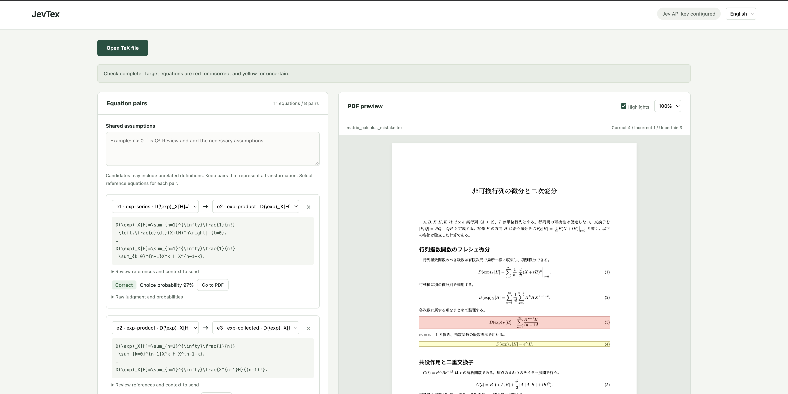

# JevTex

[English](#english) | [日本語](#日本語)

## English

A local web app that uses Jev to check mathematical transformations in TeX, from one equation to the next. It highlights the resulting equation in the PDF: **red for incorrect**, **yellow for uncertain**.



Review equation pairs and shared assumptions on the left, and inspect their locations in the PDF on the right. **Go to PDF** jumps to the corresponding equation; **Highlights** toggles the overlays. The screenshot shows the matrix-calculus sample and illustrates the interface, not a benchmark of model accuracy.

### Getting started

Requirements: Python 3.12–3.14, uv, Node.js 22 or later, and LuaLaTeX with Japanese support and SyncTeX for PDF generation.

```sh
cd JevTex
uv sync --frozen
npm ci --ignore-scripts
uv run python -m jevtex
```

Open [http://127.0.0.1:8765](http://127.0.0.1:8765). The startup command binds only to localhost. Press Ctrl+C to stop.

If TeX is not installed on your Mac, run `bash scripts/setup_tex.sh`. This extracts BasicTeX from the official Homebrew cask into `.tools/texlive` and installs luatexja and HaranoAji for Japanese documents. It requires no administrator privileges and does not change the system TeX configuration or PATH. The directory is excluded from Git. Existing LuaLaTeX and SyncTeX installations are also detected through PATH or `/Library/TeX/texbin`.

To enable Jev judgments, set the API key **in the same terminal before starting the app**. In macOS zsh, these commands read the key without displaying it or including its value in shell history:

```zsh
read -rs 'TYPESAFE_API_KEY?TypeSafe API key: '; echo
export TYPESAFE_API_KEY
uv run python -m jevtex
```

The key is used only to authenticate with the official TypeSafe API. There is no browser field for the key, and it is not included in source files, logs, result JSON, PDFs, or the TeX subprocess environment. `.env.example` lists configuration names; `.env` is not loaded automatically. Without a key, you can still import TeX, view PDFs, and edit equation pairs.

### How to use

1. Select **Open TeX file** and load a single UTF-8 `.tex` document (up to 1 MB).
2. Review the suggested before/after equation pairs. Remove unrelated definitions and add or change pairs as needed.
3. Check the shared assumptions and each pair's reference equations and surrounding text to be sent.
4. Select **Check with Jev** to send the selected equations, definitions, assumptions, and surrounding text to the official TypeSafe API.
5. Review the judgments and probabilities. Use **Go to PDF**, toggle highlights, and save a separate annotated PDF or the results as JSON.

Both the preview and the saved PDF use red for incorrect transformations and yellow for uncertain judgments, including low-probability choices. Red takes priority if both apply to the same equation. Communication failures and equations without a known PDF location are not highlighted.

The API payload does not include the input filename, document title, unselected full text, or ground-truth data. Sensitive information within selected equations or surrounding text will be sent. The app does not automatically correct equations or assumptions.

### Interface languages

Use the menu in the upper-right corner to switch between Japanese and English. Your choice is saved in the browser; Japanese is the default. Switching languages preserves the document, equation pairs, entered assumptions, results, and PDF zoom. Document text, equations, user input, and raw API data are not translated.

Translations live in `static/locales.json`. To add a language, copy `ja`, use the language code as the key, and provide its display `name` and translated `messages`. It appears in the menu automatically without UI code changes. Preserve placeholders such as `{pairs}`. Missing translations fall back to Japanese.

The `server.*` entries translate existing Japanese API and saved-result messages for display. If server warnings or errors change, update the corresponding Japanese message mappings as well. Unknown diagnostics are shown unchanged.

```sh
node tests/test_i18n.mjs
```

### Judgments and test data

Jev's `Choice` has three options: `correct / incorrect / uncertain`. If the choice probability is below the provisional threshold of 0.8, the UI displays an uncertain judgment. The raw choice, probabilities, and confidence remain available; confidence and choice probability are different values. The default model is `jev-1.13.0`, overridable with `JEV_MODEL`. Communication failures are displayed separately from uncertain judgments. Only HTTP 429, 529, and 503 are retried, up to two times, with a 30-second timeout per request.

The evaluation unit is a **local mathematical transformation**. Even if the starting equation contains an earlier error, a valid next transformation is judged correct. Jev is not a theorem prover and does not guarantee mathematical correctness.

| File | Contents |
| --- | --- |
| `examples/laplacian_correct.tex` | Two-dimensional polar-coordinate Laplacian with Japanese explanations: 12 equations, 6 pairs, 2 pages. |
| `examples/laplacian_mistake.tex` | Omits `f_r/r` in e10→e11. The subsequent e11→e12 factorization is valid even though it inherits the omission. |
| `examples/expected.json` | Expected judgments, explanations, and shared assumptions. Used only by the evaluation script, never sent to Jev. |
| `examples/matrix_calculus_mistake.tex` | Advanced sample covering matrix exponentials, double commutators, and the second variation of the log determinant: 11 equations, 8 pairs, 3 newly introduced errors. Load it through the file picker. |
| `examples/matrix_calculus_answers.md` / `matrix_calculus_expected.json` | Error locations, corrected formulas, rigorous counterexamples, and expected judgments for the advanced sample. Answers are not sent to Jev. |

The advanced sample's ground truth is checked with independent SymPy calculations in `tests/test_matrix_sample.py`. The implementation-time record below does not establish live Jev accuracy. The PDF-generation and live API evaluation scripts below target the two Laplacian documents.

```sh
# Mock API, extraction, independent SymPy calculations, and boundary conditions
uv run python -m unittest discover -s tests -v
node tests/test_highlights.mjs

# Also test real TeX compilation, SyncTeX, PDF annotations, and the app API
# Jev responses remain mocked
JEVTEX_INTEGRATION=1 uv run python -m unittest discover -s tests -v

# Generate sample PDFs and a demo PDF highlighted using ground-truth labels
uv run python -m scripts.build_examples

# Evaluate live Jev accuracy: requires a key and makes API calls for 12 pairs
uv run python -m scripts.evaluate
```

Live evaluation writes the detection rate, false-positive count, uncertain count, communication failures, and all pair results to `output/evaluation.json`. It exits with code 1 on a mismatch with expected judgments, or code 2 when no key is configured and evaluation is skipped. Ground-truth labels are kept out of API inputs. Two documents with one intentional error are too small a dataset to represent general mathematical ability.

`output/pdf/mistake/overlay-demo.pdf` is a **display demo based on ground-truth data, not a Jev detection result**. Its companion JSON is labeled `oracle-demo-NOT-Jev`. Mock-test success and live-model accuracy are reported separately.

### Supported input and storage

- Supported: document-level `equation`, `equation*`, `align`, `align*`, and `\[...\]`. Top-level line breaks split align rows; internal breaks in matrices and similar structures are preserved. An omitted left-hand side is inherited from the previous align row.
- Candidate pairs are adjacent equations within the same section. Reference equations must precede the target equation. Custom macro expansion, multiple files, images, standalone PDFs, and environments such as `gather` are not supported; warnings or input errors are displayed.
- LuaLaTeX runs twice. SyncTeX records at the environment's closing line are matched exactly. Because amsmath records all align rows at that line, the outer display boxes are assigned in order. A box/row count mismatch leaves the location unavailable. Individual symbols within equations are not located.
- The original TeX is unchanged; a copy is saved to `.jevtex/<document-id>/document.tex`. PDFs, SyncTeX, results, and logs are stored alongside it. Uploads and generated files are excluded from Git. Documents persist until manually deleted; stop the app before deleting an unwanted document directory.
- The app is intended for locally processing TeX you control. Shell escape is disabled, subprocess environment variables are restricted, and each compilation is limited to 90 seconds. This is not an OS sandbox for safely running arbitrary Lua/TeX. Do not use it as a public server.

The frontend serves PDF.js locally, with no CDN, analytics, or external fonts. Local dependencies, uploaded documents, and generated output are excluded from Git.

### Internal API

POST requests require a matching origin and the `X-JevTex-Client: 1` header. No API accepts an authentication key from the browser.

| API | Input / output |
| --- | --- |
| `GET /api/status` | Whether a key is configured, model, threshold, and TeX-tool availability. Never returns the key itself. |
| `POST /api/documents` | `{name, source}` → document ID, extracted equations, candidates, locations, and warnings. Extraction results are returned even if compilation fails. |
| `POST /api/documents/{id}/check` | `{pairs:[{before, after, context_ids}], assumptions}` → judgment results; up to 50 pairs per request. |
| `GET /api/documents/{id}/pdf` | Original PDF; `?annotated=true` returns a separately named annotated PDF. |
| `GET /api/documents/{id}/results` | Result JSON with equation IDs, source positions, probabilities, model, and PDF locations. |

PDF locations use one-based page numbers and `rect=[x0,y0,x1,y1]` in PDF points, with the origin at the bottom left. PDF.js's viewport converts these to screen coordinates; the saved PDF uses the same rectangles.

Specification sources: [TypeSafe API](https://docs.typesafe.ai/api), [known weaknesses](https://docs.typesafe.ai/model-jaggedness/jev-1.13), [PDF.js](https://mozilla.github.io/pdf.js/examples/), and [pypdf annotations](https://pypdf.readthedocs.io/en/stable/user/adding-pdf-annotations.html).


---

## 日本語

TeXの「式1 → 式2」をJevで判定し、変形後の式をPDF上で誤りは赤、判断保留は黄色で表示するローカルWebアプリ。


左側で比較ペアと共通の前提条件を確認し、右側でPDF上の該当箇所を確認できます。「PDFへ」で数式に移動し、ハイライトの表示も切り替えられます。画像は行列微分サンプルを開いた英語UIの例で、モデル精度の評価結果を示すものではありません。

### 起動

このMacではプロジェクト内の `.tools/texlive` にBasicTeXと日本語パッケージを準備済みです。システムのTeX設定やPATHは変更していません。

```sh
cd JevTex
uv sync --frozen
npm ci --ignore-scripts
uv run python -m jevtex
```

[http://127.0.0.1:8765](http://127.0.0.1:8765) を開きます。起動コマンドはlocalhostだけにバインドします。停止はCtrl+Cです。

Jevで判定する場合は、**起動前に同じターミナルで**環境変数を設定します。macOSのzshなら次のコマンドでキーを画面・シェル履歴に表示せず入力できます。

```zsh
read -rs 'TYPESAFE_API_KEY?TypeSafe API key: '; echo
export TYPESAFE_API_KEY
uv run python -m jevtex
```

キーはTypeSafe公式APIへの認証にだけ使用します。ブラウザ入力欄は設けておらず、ソース・ログ・結果JSON・PDF・TeX子プロセスには含めません。`.env.example` は設定名の例で、`.env`の自動読込はしません。キーなしでもTeX取り込み・PDF閲覧・比較ペア編集はできます。

別のMacでTeX未導入の場合は `bash scripts/setup_tex.sh` を実行してください。公式Homebrew caskのBasicTeXを `.tools/texlive` に展開し、日本語用のluatexja・HaranoAjiを追加します。管理者権限不要で、このディレクトリはGit対象外です。既存のLuaLaTeXとSyncTeXはPATHまたは `/Library/TeX/texbin` からも検出します。Python 3.12–3.14、uv、Node.js 22以降が必要です。

### 使い方

1. 「TeXファイルを開く」からUTF-8の単一TeX（1MB以下）を読み込みます。
2. 自動候補の式1・式2を確認します。別々の定義は除外し、必要なら追加・変更します。
3. 共通の前提条件と、各ペアの「参照式と送信する周辺説明」を確認します。
4. 「Jevで判定する」を押すと、選択した式・定義・前提・周辺説明をTypeSafe公式APIへ送ります。
5. 判定・確率を確認し、「PDFへ」で該当箇所に移動します。ハイライトの表示を切り替え、別名の注釈付きPDFと結果JSONを保存できます。

画面と保存PDFは、誤りを赤、判断保留（確率不足を含む）を黄色で表示します。同じ式に両方の判定がある場合は赤を優先します。通信失敗と位置未取得の式には色を付けません。

入力ファイル名、文書タイトル、未選択の全文、正解データはAPIに送りません。数式自体や周辺説明に機密情報がある場合は送信対象になります。数式・前提の自動修正は行いません。

### 表示言語

右上の言語メニューで日本語・英語を切り替えます。選択はブラウザに保存され、未選択時は日本語です。切替時に文書・比較ペア・入力済みの前提・判定結果・PDF倍率は保持します。文書本文、数式、ユーザーの入力、APIの生データは翻訳しません。

翻訳は `static/locales.json` に集約しています。言語を追加する場合は `ja` を複製し、言語コードをキーとして `name` にその言語の名称、`messages` に翻訳を設定します。メニューには自動で追加され、画面側の編集は不要です。`{pairs}` などのプレースホルダーは保持してください。翻訳が欠けた項目は日本語に戻ります。

`server.*` は既存API・保存結果の日本語メッセージを画面上で翻訳する項目です。サーバーの警告やエラーを変更した場合は、日本語側の対応文言も更新してください。未知の診断メッセージは原文のまま表示します。

```sh
node tests/test_i18n.mjs
```

### 判定とテストデータ

Jevの`Choice`は `correct / incorrect / uncertain` の3択です。選択確率が暫定閾値0.8未満なら画面では判断保留とし、生の選択・確率・confidenceも表示します。confidenceと選択確率は別の値です。モデルは`jev-1.13.0`に固定し、`JEV_MODEL`環境変数で変更できます。通信失敗は判断保留とは別に表示します。429・529・503だけ上限2回の再試行、各リクエストのタイムアウトは30秒です。

評価単位は**局所的な式変形**です。式1に以前の誤りがあっても、その式を出発点とした次の変形が正しければcorrectです。Jevは証明器ではなく、数学的な正しさを保証しません。

| ファイル | 内容 |
| --- | --- |
| `examples/laplacian_correct.tex` | 日本語の説明付き2次元極座標ラプラシアン。12式、6比較ペア、2ページ。 |
| `examples/laplacian_mistake.tex` | e10→e11で `f_r/r` を脱落。e11→e12は欠落を引き継ぐが、くくり出しは正しい。 |
| `examples/expected.json` | ペアごとの期待判定・説明と共通の前提。評価スクリプト専用でJevへ送信しない。 |
| `examples/matrix_calculus_mistake.tex` | 高難度：行列指数・二重交換子・対数行列式の二次変分。11式、8比較ペア、新しい誤り3か所。ファイル選択から読み込む。 |
| `examples/matrix_calculus_answers.md` / `matrix_calculus_expected.json` | 高難度サンプルの誤りの位置・正しい式・厳密な反例と期待判定。解答はJevへ送信しない。 |

高難度サンプルの正解は `tests/test_matrix_sample.py` で独立したSymPy計算により確認する。実Jevによる判定は未実施。下記のPDF作成・実API評価スクリプトは従来のラプラシアン2文書を対象とする。

```sh
# 模擬API、抽出、独立したSymPy計算、境界条件
uv run python -m unittest discover -s tests -v
node tests/test_highlights.mjs

# 実TeXコンパイル、SyncTeX、PDF注釈とAPI全体も検証（Jev応答は模擬）
JEVTEX_INTEGRATION=1 uv run python -m unittest discover -s tests -v

# サンプルPDFと、正解データで赤い位置を示すデモPDFを作成
uv run python -m scripts.build_examples

# 実際のJevによる精度評価：キーが必要・12ペア分のAPI呼び出し
uv run python -m scripts.evaluate
```

実API評価は `output/evaluation.json` に検出率・誤検出数・保留数・通信失敗数・全ペアの結果を保存します。期待判定と不一致なら終了コード1、キー未設定なら未実施として終了コード2です。正解ラベルはAPI入力から分離します。2文書・意図的な誤り1件という小さなデータのため、結果を一般的な数学能力とみなさないでください。

`output/pdf/mistake/overlay-demo.pdf` は**正解データによる表示デモで、Jevによる検出結果ではありません**。同名のJSONにも `oracle-demo-NOT-Jev` と記録します。模擬テストの成功と実モデル精度は別に報告します。

### 対応範囲と保存

- 対応：文書直下の`equation`、`equation*`、`align`、`align*`、`\[...\]`。align内の最上位の改行を区切り、matrix等の内部改行は保持します。省略された左辺は前のalign行から補います。
- 比較候補は同じ節の隣接式。参照式は式2より前の式を選びます。独自マクロ展開、複数ファイル、画像、PDF単体、`gather`等には未対応で、警告・入力エラーを表示します。
- LuaLaTeXを2回実行し、SyncTeXで環境末尾の正確な記録を照合します。amsmathのalignは全行が環境末尾に記録されるため、外側の表示ボックスを順番に対応付けます。ボックス数が行数と一致しない場合は「位置未取得」にします。数式中の個別の記号位置までは判定しません。
- 元のTeXは変更せず `.jevtex/<文書ID>/document.tex` にコピーします。PDF、SyncTeX、結果、ログも同じ作業フォルダへ保存します。生成物とアップロード内容はGit対象外です。文書ごとに保存され、自動削除はしません。不要になった作業フォルダはアプリ停止後に手動で削除できます。
- 本人が管理するTeXをローカルで扱う用途です。shell escapeは禁止し、環境変数を絞り、コンパイルは各90秒で打ち切ります。任意のLua/TeXを安全に実行できるOSサンドボックスではありません。公開サーバーとして使用しないでください。

フロントエンドはPDF.jsをローカル配信します。CDN、分析ツール、外部フォントは使用しません。Gitにはコード・TeX・正解データ・ロックファイルだけを含め、リモートリポジトリは設定しません。

### 内部API

POSTは同一originと `X-JevTex-Client: 1` ヘッダーを要求します。認証キーをブラウザから受け取るAPIはありません。

| API | 入出力 |
| --- | --- |
| `GET /api/status` | キー設定の有無、モデル、閾値、TeXツール有無。キー値は返さない。 |
| `POST /api/documents` | `{name, source}` → 文書ID・抽出式・候補・位置・警告。コンパイル失敗時も抽出結果を返す。 |
| `POST /api/documents/{id}/check` | `{pairs:[{before, after, context_ids}], assumptions}` → 判定結果。1回最大50ペア。 |
| `GET /api/documents/{id}/pdf` | 原PDF。`?annotated=true`で注釈付きの別名PDF。 |
| `GET /api/documents/{id}/results` | 結果JSON。式ID・ソース位置・確率・モデル・PDF位置を含む。 |

PDF位置は1始まりのページ番号と、左下原点・PDF point単位の`rect=[x0,y0,x1,y1]`です。PDF.jsのviewportで画面座標に変換し、保存PDFにも同じ矩形を使います。

仕様の出典：[TypeSafe API](https://docs.typesafe.ai/api)、[既知の弱点](https://docs.typesafe.ai/model-jaggedness/jev-1.13)、[PDF.js](https://mozilla.github.io/pdf.js/examples/)、[pypdf注釈](https://pypdf.readthedocs.io/en/stable/user/adding-pdf-annotations.html)。

